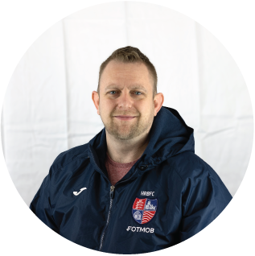

Get to know the dedicated individuals who make up our elected board, working tirelessly to represent the interests of all supporters and contribute to the success of The Beavers Trust. Feel free to approach any of them on matchdays or [contact the Trust](/contact) if you have matters you'd like us to address.

# Our Board
_________________________________

 **Stefan Rance** - Chair

chairman@thebeaverstrust.com

I've been coming to the home of football since 1989 and been a regular ever since. Over this period I've done, pretty, much all roles that were available from running the bar, producing the programme, being on the committee and board, occasional groundsman and really bad tannoy announcer (seriously check out the worst bits on Andy Eggletons You Tube channel!)

I'm now Secretary of the Youth section and my eldest is currently in the academy. I want the Trust to be representative of the entire supporter base, ensure that our supporters are being given the best Hampton experience there is and work within the community to promote the club and provide help and support where we can to Hampton fans and the much wider community.

--------------

 **Matt Williams** - Vice-Chair

--------------

 **Chris Hurst** - Secretary

secretary@thebeaverstrust.com

--------------

 **Curt Higgins** - Treasurer

treasurer@thebeaverstrust.com

--------------

 **Ben Harrison-Hyde** - Media and Communications

 media@thebeaverstrust.com

--------------

 **Phil Weller** - Board Member

Season ticket holder since 2007 and a founder member of the Beavers Trust. Took a lead role in the six figure refurbishment of the main terrace and seating stand.

Served as Trust Chairman for several years and represented the Trust on the main club board in its role as a Corporate Director, and more recently as a personal director. Resigned from that role earlier this year. Previously spent 2 years as Club Covid Officer. Can normally be found helping with matchday parking pre game and with stewarding soon after.

--------------

 **Iain MacKinnon** - Board Member
 
 trust.news@thebeaverstrust.com

 I am a Scot who has lived in London for 20 years. After moving to the local area I fell in love with the Beavers after my first visit in 2016 and have been a fan ever since. 
 
 I volunteered for several years doing odd jobs around Beveree and making friendSs before being invited onto the Trust Board. I was humbled to be elected following our first democratic elections and I am now more involved than ever in ensuring the fans are at the heart of our warm and welcoming club.

--------------

 **James Dean** - Board Member

I’ve been following HRBFC for many years now, and a season ticket holder since 2000.  I enjoy seeing people coming together for a common cause, and am keen to help make the matchday experience to be the best it can be for all supporters.

I’ve been involved in football all my life, originally as a player, and then more recently as a coach for a local youth team, and now as a supporter.  As such, I am keen to actively contribute and give something back to the sport.

I’ve lived in Twickenham for over 20 years, and I work in a regional leadership role in the retail industry.

I am married with two children and divide my footballing allegiance between The Beavers and Manchester United.

--------------

# Other member roles & support

 **David Rees** - Web Admin

 admin@thebeaverstrust.com

Dave has been involved in Hampton since 1995, starting as a helper at Saturday morning mini-soccer moving into helping the main club on match-days eventually taking over as Safety Officer and Operations manager in 2000. 

Dave left the club as a volunteer in 2022 but continues to support the Beavers Trust, he also continues to support numerous clubs around the area with their development of operations and stadium safety. Dave currently supports the trust with its online tools. 

___________________

Our board members bring a diverse set of skills and experiences to The Beavers Trust, ensuring that we have a well-rounded team working on behalf of the supporters. We encourage open communication, and your [feedback is always welcomed](/contact). Together, we can continue to strengthen the bond between the club and its passionate fanbase.