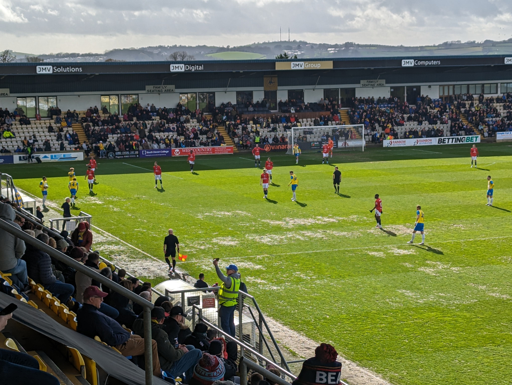

The Beavers Trust coach travelled down to Devon to watch Hampton take on Torquay United in the Vananrama National League South, whilst the result was not what the Beavers were looking for it was a good day trip for all those who travelled. 

First half action viewed from the away seats

The match was far from a classic, with both teams struggling to break each other down, in the end the result was decided by a 28th minute Asa Hall penalty. However Torquay United provided the normal warm welcome to the travelling Beavers. 

<iframe width="280" height="157" src="https://www.youtube.com/embed/_xvcQUPS_2o?si=Ye7vjMgKtI2Zjzrw" title="YouTube video player" frameborder="0" allow="accelerometer; autoplay; clipboard-write; encrypted-media; gyroscope; picture-in-picture; web-share" referrerpolicy="strict-origin-when-cross-origin" allowfullscreen></iframe>

Read the [clubs match report](https://hamrichfc.com/blogs/news/first-half-penalty-condemns-beavers) or watch the highlights above from our visit to Plainmoor

[**Non-league James**](https://youtube.com/@nonleaguejames?si=p5yzWQvV_XP9_IPX) has also put together a super video on our coach travel, please give it a watch and give James a follow too!

<iframe width="560" height="315" src="https://www.youtube.com/embed/wyV1FOSIay8?si=3DXrFwFyYf4RGSSK" title="YouTube video player" frameborder="0" allow="accelerometer; autoplay; clipboard-write; encrypted-media; gyroscope; picture-in-picture; web-share" referrerpolicy="strict-origin-when-cross-origin" allowfullscreen></iframe>

Don't forget we have a coach for Worthing on Easter Monday, book now!

 Buy Coach Travel 

Beavers and Gulls Pride flags proudly displayed together

