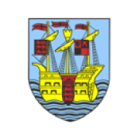
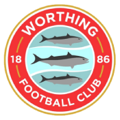

We wanted to provide supporters with a quick update on our coach travel plans for supporters coach travel in February and March. 

## **Tuesday 20th February - Weymouth**

Sadly due to low numbers showing interest in this midweek journey it is not viable for us to run a coach on this occasion. We know this maybe disappointing for some fans however we do know several people are going to be driving down so please do ask around the Beveree.

We will provide some details on other transport options in our "fans guide to Weymouth" which we will public in the coming days. 

## **Saturday 23rd March - Torquay United**

We are pleased to confirm we will be running a coach to Torquay United in March. 

Departure time will 9.15am from Beveree

Return will leave Plainmoor shortly after final whistle

**Prices - Torquay**

- **Adult Member:** £35
- **16/17 Years Member:** £25
- **Under 16 Member:** £20
    
- **Adult Non-Member:** £45
- **16/17 Non-Member:** £30
- **Under 16 Non-Member:** £25

 Book Torquay Coach 

## **Monday 1st April - Worthing**

We are also pleased to say we are planning to run a coach to Worthing for our fixture on Easter Monday.

Departure time will be 11.30am from Beveree and will arrive in time to provide an opportunity for fans to visit the sea front and town before the match. 

Return will leave Woodside Road shortly after final whistle

**Prices - Worthing**

- **Adult Member:** £25
- **16/17 Years Member:** £20
- **Under 16 Member:** £17.50
    
- **Adult Non-Member:** £35
- **16/17 Non-Member:** £25
- **Under 16 Non-Member:** £20

 Book Worthing Coach 

Thank you for your continued support of the Trust and the Club and we look forward to seeing you on an away day. 
