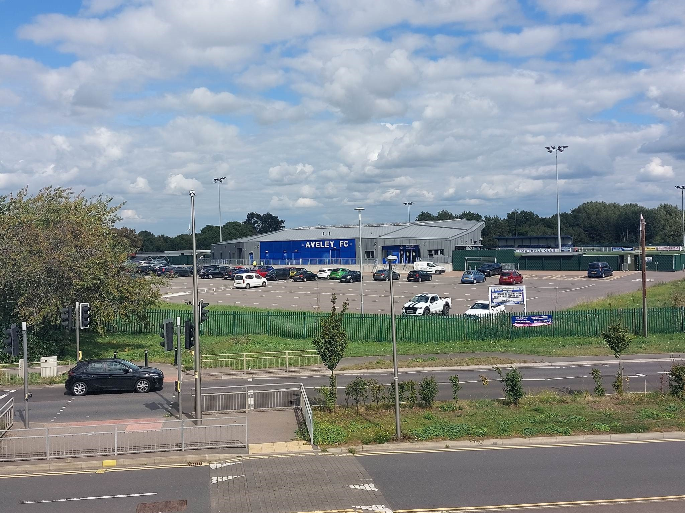

- What: Aveley vs Hampton & Richmond Borough
- When: Saturday, 1st March 2025, 3pm kick-off
- Where: Aveley FC, Parkside, Park Lane, Aveley, Essex, RM15 4PX
- Fan Meet: 10:50am at Waterloo Station (under the clock)
- Supporter’s Coach: No

# Overview & Form Guide
Hampton will be hoping to recover from a recent dip in form with five straight defeats now behind Alan Julian’s men… the Beavers are without a win since 28th January, writes Chris Hurst.  Some might say there’s no better fixture in which to recover than against basement club Aveley.  An unlikely 2-0 win against Maidstone United earlier this month proved to be a false start for the Millers, who went on to lose their next three fixtures, including a 4-1 humbling against fellow strugglers Weymouth, putting them 24th in the table on just 23 points, currently nine points from safety.  Of course, they’ll be fighting for their lives and with an unfamiliar artificial playing surface this could be a tricky fixture for Hampton.

# Fan Travel
There’s no supporters coach for this one, if you’re driving Aveley’s Parkside ground is in spitting distance from the M25, Junction 30.  Head onto the A13 (Westbound), exit at the first junction onto A3016 Arterial Road (Southbound), take the first left onto Purfleet Road which will take you into the town of Aveley.  There is a big car park at Aveley’s Parkside ground so you should be okay for parking, I cannot find confirmation online of whether there is any charge – best to take some coins just in case.

For those taking the train, a small group of us are taking the 10:16am from Feltham into London Waterloo, meeting others under the clock at 10:50am before taking the Jubilee Line to West Ham, followed by a c2c train to Rainham or Chafford Hundred where the 372 bus can be picked up to take you into the town of Aveley (alight from the 372 at Field Road bus stop).  The 372 is a TFL operated London Bus and Rainham Station is in Travelcard Zone 6, so it’s possible to complete the entire journey with a Zone 1-6 travelcard.

# Match Tickets
Match tickets are priced at £16 (adults), £12 (concessions), £5 (11-18 year olds), and free for Under 11s.  You can purchase your tickets in advance at the link at the bottom of this article or at the turnstiles on Saturday – there is no saving for booking in advance.  This fixture is not being segregated so you don’t need to worry about selecting a particular part of the ground.

# Stadium
Aveley’s Parkside is a new stadium but I don’t dislike it in the way I dislike most new stadiums.  It’s clean and tidy, the main seated area along one side of the pitch reminds you a little bit of Slough Town or Dulwich Hamlet’s main stands (with the bar, boardroom and changing rooms under and behind the stand).  There are two small covered terraces behind each goal, ample parking and lots of unused space around the ground for any future development.  The bar itself is spacious and offers good views of the pitch, the staff were very friendly and efficient last season.  Their matchday programme is printed on the smallest size paper you will ever find, very handy for pocket storage.  The ground is situated just to the north-east of the small town of Aveley, a 10-minute walk from the town centre and 372 bus stop.

# Pubs / Pre-Match
When we visited the town last season we noted with sadness that the Crown & Anchor Bar had closed and was boarded up; fortunately there are two other pubs available on the main Purfleet Road/High St.  We headed for the Ship Inn (58 High St, RM15 4AD) which appears in the Campaign for Real Ale’s National Inventory of Pub Interiors – but unfortunately it was closed on Mondays so we didn’t have a drink in there last season, hopefully we will get to visit this time around.  The other pub in town is the Top House (Purfleet Rd, RM15 4DL) which is a free house that came under new management during the covid-era and has good reviews online.

View of Aveley’s Main Stand and car park, 28 Aug 2023. Photo: Chris Hurst

# Fun Facts
The Beavers have faced the Millers 36 times historically, with Hampton winning 15 of those encounters, drawing six and losing 15, a very balanced record indeed.  The two sides would often compete against each other in the Isthmian League during the 1970s and 1980s, but with Hampton’s gradual climb up the pyramid since the mid-1990s the sides have met very few times since then.  Among Aveley’s few and questionable claims to fame, crime writer Martina Cole comes from the town, as does former West Ham and Spurs midfielder Paul Allen.  Going back further in time, John Newton, the evangelical preacher and author of the hymm Amazing Grace lived in the town.  Happy travels, see you in Essex, get behind the team and make plenty of noise… how sweet the sound!

 Buy Match Tickets  

<iframe src="https://www.google.com/maps/embed?pb=!1m18!1m12!1m3!1d2483.545881042832!2d0.25803087661984425!3d51.503200471812264!2m3!1f0!2f0!3f0!3m2!1i1024!2i768!4f13.1!3m3!1m2!1s0x47d8b090f64646d1%3A0xdd59a913226bde80!2sParkside%20-%20Aveley%20Football%20Club!5e0!3m2!1sen!2suk!4v1740692136023!5m2!1sen!2suk" width="600" height="450" style="border:0;" allowfullscreen="" loading="lazy" referrerpolicy="no-referrer-when-downgrade"></iframe>