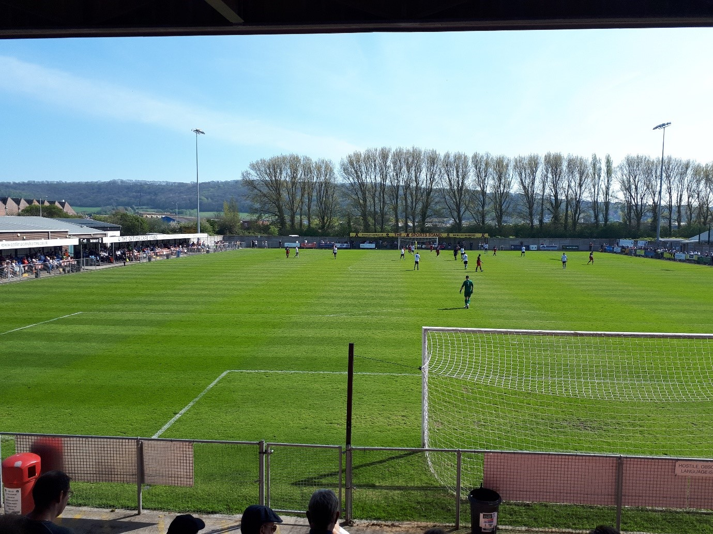

What: Weston-super-Mare vs Hampton & Richmond Borough

When: Saturday, 22nd February 2025, 3pm kick-off

Where: Weston-super-Mare AFC, Woodspring Stadium, Winterstoke Road, Weston-super-Mare, Somerset, BS24 9AA

Fan Meet: 08:30 train from London Paddington

Supporter’s Coach: No

## Overview
Alan Julian’s men will be looking to return to form with a big win against one of the division’s playoff challengers as we travel to Somerset this Saturday to face a Weston-super-Mare side who sit eighth in the table, writes Chris Hurst.  A win for the Seagulls could take them back into the top seven and a playoff position; for the Beavers this contest is about not letting the top seven pull out of sight, Hampton will begin the afternoon in 10th position.  Recent signing Rudy Allen is tipped to make his debut appearance for the club and it’s possible that Jake Gray could also start in midfield, having returned to the squad last weekend.  A large group of Hampton fans are travelling to the fixture, with some birthdays being celebrated, so it’s likely to be a boisterous and noisy away support.  Alex Wall remains suspended following his red card against Truro City but apart from that there should be a full squad to pick from.

## Form Guide
Hampton have suffered a lull in form recently, although nobody has been able to explain to me quite how we didn’t take anything from our match against Chippenham Town at Beveree last weekend, absolutely dominating particularly during the second half. In our last five, Hampton have picked up one win, one draw and suffered three losses.  Our hosts have fared somewhat better in recent fixtures, boasting three wins, one draw and one defeat in their last five.  Among their wins was an impressive and perhaps unexpected 1-0 victory at Boreham Wood’s Meadow Park, however it should be pointed out they are without a win on home soil since 23rd November last year, so the form guide heavily favours the away side, at least by that metric anyway!

## Fan Travel
There’s no supporters coach for this one, so trains are the recommended mode of transport on Saturday. Trains depart London Paddington twice an hour (on the hour and at half past), a large group of Hampton fans are booked onto the 08:30 departure from Paddington, so come and join us!  The journey time is approximately two hours, so the 08:30 will arrive into Weston-super-Mare at 10:32.  Travelling home we plan to catch the 18:02 which arrives back into London Paddington at 20:05.  Of course, you could also board and alight at Reading instead of London Paddington.

If you’re driving, the postcode for your Satnav is BS24 9AA.  Exit the M5 at Junction 21 and head west on Somerset Ave/A370 which will take you towards town.  Parking is available at the stadium for £2, but payment is by card only.  Once the stadium’s car park fills up, supporters are advised to park in the two nearby industrial estates, which are a 5-10 minute walk from the stadium, please note supporters are asked not to park in the housing estate directly opposite the club.

## Stadium
Weston-super-Mare’s Woodspring Stadium (branded as the Optima Stadium due to sponsorship) always reminds me of Woking FC’s Kingfield Stadium – it has one enormous stand behind the goal at the northern end of the ground which dwarfs the rest of the stadium!  This covered stand offers a mixture of terracing and seating at the front, unusual but works well.  The opposite southern end is open terracing and undeveloped. You enter the ground from Winterstoke Road at the eastern side, where the clubhouse, director’s boxes and some covered seating is available.

View from the north stand, 20th April 2019. Photo: Chris Hurst

## Match Tickets
- Match tickets are priced at £15 (adults)
- £11 (concessions, which means Over 60s, Student ID, Armed Forces ID, NHS ID), 
- £6 (14-17 year olds), 
- £4.50 (9-13 year olds)
- free for Under 8s  

A family ticket option is available for £32 (2x Adults and 2x Under 13s).  You can purchase your tickets in advance at the link at the bottom of this article or at the turnstiles on Saturday – there is no saving for booking in advance.  This fixture is not being segregated so you don’t need to worry about selecting a particular part of the ground.  Cash and card is accepted on the turnstiles although there is only one cash turnstile as card is prioritised.

 Buy Match Tickets Weston-Super-Mare  

## Pubs / Pre-Match
The football club is based to the east of the town centre, between the Bournville and Haywood Village districts.  It’s approximately a 25-30 minute walk from Weston-super-Mare Station (around a mile and a half) and a similar distance from the seafront and town centre.  If you don’t fancy the walk, the Number 7 First Bus service stops directly outside the stadium and runs at regular 20-30 minute intervals from the town centre.  Hampton supporters will be pub crawling around town before the match and here are some of the standout options: 

The Black Cat (135 High St, BS23 1HN) is a micro-pub serving keg beers, lots of ciders and with a good range of snacks, it’s situated just a couple of minutes back from the seafront; making your way southwards the Fork n’ Ale (18 Walliscote Rd, BS23 1UG) looks like another good option.  This taproom and kitchen establishment opened in 2019 and boasts a marvellous Gin Shelf with lots of specials and food cooked with locally sourced ingredients; just along from the Fork n’ Ale is the Duke of Oxford (27 Oxford St, BS23 1TF), it’s a free house but it offers more of a traditional pub experience for those who prefer, it serves home-made roasts on Sundays for any Beavers staying for the weekend!  Our final mention is the Brunello Lounge (4-5 Beach Road, BS23 1AS), this place is a bit more of a café-bar which focuses mainly on food and is family and dog friendly.  There are plenty of other pubs hidden around the town’s streets and the place is well worth exploring!

## Culture
For local culture, we recommend a visit to the Weston Museum (Burlington Street, BS23 1PR), it’s open from 10am to 4pm on Saturdays and you don’t need to pre-book.  The museum is housed in a beautiful and distinctive historic building and tells the story of the town from prehistoric times to the modern day, admission is free but no dogs other than assistance dogs are allowed in.  The other notable tourist activity is of course a visit to Weston’s famous Grand Pier, it’s £1 per person to enter the pier and there’s always plenty going on.

## Fun Facts
Until very recently Weston-super-Mare boasted the proud record of never having been relegated.  They were founder members of the then Conference South in 2004 and remained in the division until their streak finally came to an end in the 2018/19 season, when they dropped back into the Southern League after finishing bottom of the National League South table on 35 points.  The Seagulls spent four seasons back in the Southern League, winning the league in 2022/23 and returning to our division for the 2023/24 season – I guess one relegation in your entire history isn’t too bad!  They have spent more seasons in this division than any other side.  Happy travels and see you in Somerset!

Useful Contacts & Links
-	General supporter enquiries: enquiries@wsmafc.co.uk

-	Purchase match tickets: [Weston-super-Mare AFC V Hampton and Richmond](https://fixr.co/en-US/event/weston-super-mare-afc-v-hampton-and-richmond-vanar-tickets-429332159)

-	Weston Museum: Weston Museum - [Experience Weston-super-Mare's History](https://westonmuseum.org/)

-	Grand Pier: The Grand Pier - [Visit Weston-super-Mare’s World Famous Grand Pier](https://www.grandpier.co.uk/)

<iframe src="https://www.google.com/maps/embed?pb=!1m18!1m12!1m3!1d2492.9118062673588!2d-2.9580339233904582!3d51.33114197177376!2m3!1f0!2f0!3f0!3m2!1i1024!2i768!4f13.1!3m3!1m2!1s0x4871f9007e6b56c1%3A0xfb346425dc727dd1!2sWESTON-SUPER-MARE%20AFC!5e0!3m2!1sen!2suk!4v1740005517882!5m2!1sen!2suk" width="600" height="450" style="border:0;" allowfullscreen="" loading="lazy" referrerpolicy="no-referrer-when-downgrade"></iframe>

