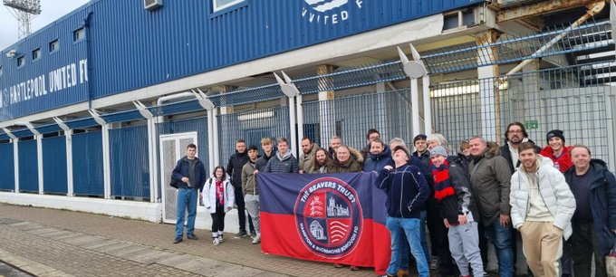

It's been an eventful month as the new Trust Board works to
shape our future in this new era, which began with our first Trust organised coach trip to Hartlepool. Before diving into Trust affairs, let's highlight a couple of important club updates. 

Firstly many thanks to everyone who joined us on the coach and at the game in supporting the team during the Isuzu FA Trophy Fourth round match against Hartlepool. The victory, marked by another penalty shoot-out win over another
National League side, made the weekend truly memorable. The journey to Wembley (dare we dream yet) continues with a match against Macclesfield at Beveree on Saturday 10th February. We welcome the reduced ticket prices for this match, which are available on the [club's website](https://hamrichfc.com/blogs/news/fa-trophy-ticket-prices-announced). 

The coach party arrives at Hartlepool

Additionally, the club has rescheduled two fixtures lost to the
weather in January. St Albans City will visit us on Tuesday 6th February at 7.45 pm, and Eastbourne Borough on 5th March at 7.45 pm. Further details can be found on the [club's website](https://hamrichfc.com/blogs/news/re-arranged-fixtures-for-february-and-march). 

The Trust Board convened on 8th January, covering a broad spectrum of topics. Administrative matters such as registered addresses, director training, insurance, and strengthening ties with the FSA and the club were discussed. 

Since our last update, we've welcomed 10 new members, bringing our total to 170. We are always looking to encourage new members to join; if you know someone interested then membership can be purchased [online](https://hampton-richmond-borough-fc-supporters-society-limit.sumupstore.com/category/membership). A larger trust membership
gives us a bigger voice and will allow us to provide even bigger voice for our fans along with more support for our work with the club, the local community and charities. Don’t forget being a member gives discount on our organised travel and we are working on other member benefits. There’s much more to come!

Discussions centred around new ways to partner with the Club and start making an impact with members, all fans, and in the community. We have written formally to the Club board expressing our positive approach, our willingness to support the club's progress and our wish to collaborate on community and charity initiatives. We will continue to develop a positive working relationship with the Club and deliver on our goals through a more visible presence and by increasing fundraising. We also aim to reward our loyal and supportive members with more news, engagement, discounts, rewards and events.

The board also touched on communication, online presence, and fundraising. We're proud to showcase our new website (thebeaverstrust.com), designed by Trust member Jason, which is your go-to source for Trust information. Future improvements will include historical content and fan-contributed articles, if you would like to help with writing articles or have ideas on other content, please [contact us](https://thebeaverstrust.com/contact/). 

Lastly, a reminder about supporter travel. The Trust is committed to providing cost-effective coach travel to the furthest away matches. Express your interest in coach travel here for selected away games, it really helps us with planning, and stay tuned for booking information on our online shop. And do let us know about ideas for next season.

Currently we have earmarked these games for potential coach travel:

- Weymouth (Tuesday 20th February)  

- Torquay United (Saturday 23rd March)  

- Worthing (Monday 1st April)  

- Maidstone (Sat 20th April)  

You can express your interest for Weymouth on this [link](https://thebeaverstrust.com/posts/weymouth-travel/) 

That concludes this month's update. The Board reconvenes later in February, and we'll share another update towards the end of the month.

**Remember, the board represents you, so feel free to approach us at matches or [contact us](https://thebeaverstrust.com/contact/) with your suggestions or concerns.**
